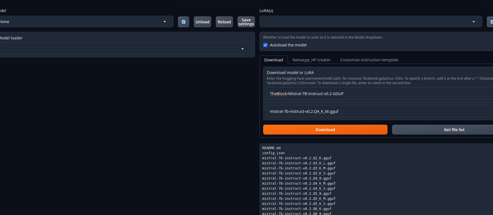

# autogen , memgpt & localllm
AutoGen & MemGPT with Local LLM: A Complete Setup
- https://www.youtube.com/watch?v=56ogF99TrzU
- https://memgpt.readme.io/docs/autogen

- venv
```
apt install python3.11-venv
python3.11 -m venv .venv
source .venv/bin/activate
python -v
pip install -r requirements.txt

```


# text-generation-webui
```
git clone https://github.com/oobabooga/text-generation-webui.git
bash start_linux.sh --api --listen --extensions openai

```




# run 
```
export OPENAI_API_BASE="http://127.0.0.1:5000"
export BACKEND_TYPE="webui"

```